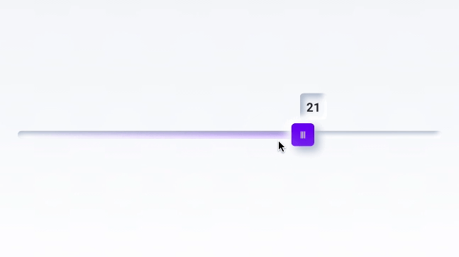
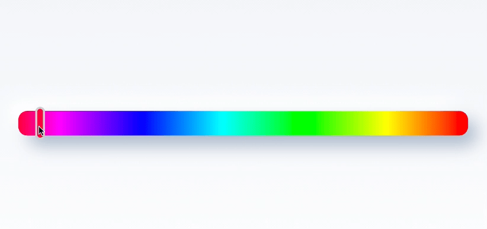
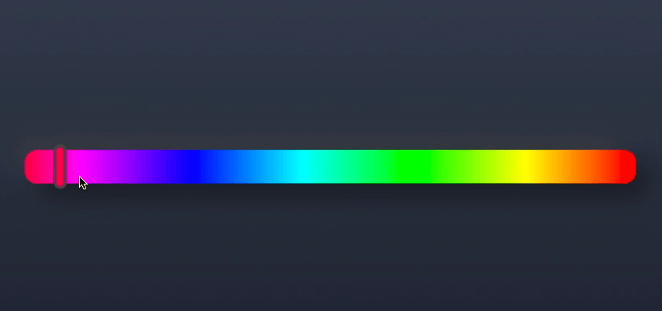

<p align="center">
  <a href="https://github.com/adrianwitaszak/neumorph-ui">
    
  </a>
</p>
<div align="center">

[](https://github.com/adrianwitaszak/neumorph-ui)
[](https://jitci.com/gh/adrianwitaszak/neumorph-ui)
[](https://jitpack.io/#adrianwitaszak/neumorph-ui)


</div>
<h1 align="center">Neumorph-UI</h1>
<p>Neumorph UI is an Android UI Library for Jetpack Compose with beautiful reusable components that are easy to use. 
It used drawing to Canvas to create views, draw custom shapes and shadows. 
The library is released to Jitpack and is available for anyone now.
The library lets everyone create pretty UI's quick and easily.</p>


### Navigation:

---
- [Features](#features-)
- [Styles](#styles)
  - [Pressed](#pressed)
  - [Punched](#punched)
- [Components](#components)
  - [Button Rounded](#buttonrounded) 
  - [Button Oval](#buttonoval) 
  - [Radio button](#radio-button) 
  - [Switch](#switch) 
  - [Slider](#slider) 
  - [Color picker](#color-picker)
  - [Coming soon](#coming-soon)
- [Documentation](https://adrianwitaszak.github.io/neumorph-ui/index.html)
- [Installation](#installation-)
- [Contributing](#contributing-)
- [Author](#author-)
- [Licence](#license-img-width40-srchttpsemojisslackmojiscomemojisimages164351746134922read-the-rulesgif1643517461)
- [References](#reference)

## Features ✨

- 🌈 Enterprise-class UI designed for Android.
- 📦 A set of high-quality Jetpack Compose components out of the box.
- 🛡 Written in Kotlin.
- ⚙️ Whole package of design resources and development tools.
- 🎨 Powerful theme customization in every detail.


## Styles


### Pressed

- Pressed Card style
- [See code](neumorph/src/main/kotlin/com/adwi/neumorph/android/PressedStatic.kt)
- [Example usage](app/src/main/kotlin/com/adwi/neumorph/sample/ui/screens/HomeScreen.kt)

```bash
MorphPressed(
    onClick: () -> Unit = {},
    elevation = 10.dp,
    cornerRadius = 30.dp,
    shape: Shape = RoundedCornerShape(cornerRadius),
    backgroundColor = MaterialTheme.colors.background,
    lightShadowColor = AppColors.lightShadow(),
    darkShadowColor = AppColors.darkShadow(),
    border = null,
    scale = 1f,
    lightSource = LightSource.LEFT_TOP,
    invertedBackgroundColors = false,
    hasIndication = false,
    modifier = Modifier.height(100.dp),
    content = { Text(text = "MorphPressed") }
) 
```
<div align="center">

</div>

## Punched

- Elevated Card style
- [See code](neumorph/src/main/kotlin/com/adwi/neumorph/android/PunchedStatic.kt)
- [Example usage](app/src/main/kotlin/com/adwi/neumorph/sample/ui/screens/HomeScreen.kt)

```bash
MorphPunched(
    onClick: () -> Unit = {},
    elevation = 10.dp,
    cornerRadius = 30.dp,
    shape: Shape = RoundedCornerShape(cornerRadius),
    backgroundColor = MaterialTheme.colors.background,
    lightShadowColor = AppColors.lightShadow(),
    darkShadowColor = AppColors.darkShadow(),
    border = null,
    scale = 1f,
    lightSource = LightSource.LEFT_TOP,
    invertedBackgroundColors = false,
    hasIndication = false,
    modifier = Modifier.height(100.dp),
    content = { Text(text = "MorphPressed") }
)
```
<div align="center">

</div>

## Components


### ButtonRounded

- Elevated button style
- [See code](neumorph/src/main/kotlin/com/adwi/neumorph/android/ButtonRounded.kt)
- [Example usage](app/src/main/kotlin/com/adwi/neumorph/sample/ui/screens/HomeScreen.kt)

```bash
MorphButtonRounded (
    elevation = 30.dp,
    cornerRadius = 25.dp,
    lightSource = LightSource.LEFT_TOP,
    modifier = Modifier.align(Alignment.Center)
) {
    Box(modifier = Modifier
        .fillMaxSize()
        .background(MaterialTheme.colors.surface)
    ) {
        SampleText("ButtonRounded")
    }
}
```
<div align="center">

</div>

### ButtonOval

- Circle button
- [See code](neumorph/src/main/kotlin/com/adwi/neumorph/android/ButtonOval.kt)
- [Example usage](app/src/main/kotlin/com/adwi/neumorph/sample/ui/screens/HomeScreen.kt)

```bash
MorphButtonOval(
    elevation = 10.dp,
    backgroundColor = MaterialTheme.colors.background,
    contentColor = MaterialTheme.colors.onBackground,
    modifier = Modifier.size(120.dp),
    content = {
        MorphIcon(
            tint = MaterialTheme.colors.onSurface,
            modifier = Modifier.size(40.dp)
        )
    }
)
```
<div align="center">

</div>

### Radio Button

- Animated radio button
- [See code](neumorph/src/main/kotlin/com/adwi/neumorph/android/RadioButton.kt)
- [Example usage](app/src/main/kotlin/com/adwi/neumorph/sample/ui/screens/HomeScreen.kt)

```bash
var value by remember { mutableStateOf(false) }

MorphRadioButton(
    elevation = 10.dp,
    radioColor = MaterialTheme.colors.secondary,
    value = value,
    onValueChange = { value = !value },
    modifier = Modifier.size(40.dp)
)
```
<div align="center">

</div>

### Switch

- Animated switch
- [See code](neumorph/src/main/kotlin/com/adwi/neumorph/android/Switch.kt)
- [Example usage](app/src/main/kotlin/com/adwi/neumorph/sample/ui/screens/HomeScreen.kt)

```bash
var value by remember { mutableStateOf(false) }

MorphSwitch(
    elevation = 10.dp,
    cornerRadius = 10.dp,
    switchColor = MaterialTheme.colors.secondary,
    value = value,
    onValueChange = { value = !value },
    modifier = Modifier
        .height(40.dp)
        .width(80.dp)
)
```

<div align="center">

</div>

### Slider

- Animated slider
- Optional label
- [See code](neumorph/src/main/kotlin/com/adwi/neumorph/android/SliderWithLabel.kt)
- [Example usage](app/src/main/kotlin/com/adwi/neumorph/sample/ui/screens/HomeScreen.kt)

```bash
val colorValue = remember { mutableStateOf(Color.Green) }

MorphColorPicker(
    color = colorValue.value,
    onColorChanged = { hsvColor: HsvColor ->
        colorValue.value = hsvColor.toColor()
    },
    elevation = 20.dp,
    cornerRadius = 30.dp,
    handleColor = Color.DarkGray,
    modifier = Modifier.height(30.dp)
)
```

<div align="center">

</div>

### Color picker

- [See code](neumorph/src/main/kotlin/com/adwi/neumorph/android/ColorPicker.kt)
- [Example usage](app/src/main/kotlin/com/adwi/neumorph/sample/ui/screens/HomeScreen.kt)

```bash
 MorphSlider(
    value = .6f,
    onValueChange = {},
    elevation = 5.dp,
    cornerRadius = 10.dp,
    backgroundColor = MaterialTheme.colors.primary,
    modifier = Modifier,
)
```
<div align="center">

</div>

## Coming soon


Here is a list of components I'm planning to build in Neumorph UI style.

- TextField
- Bottom Nav
- App bar
- Popup
- Circular progress indicator
- Dial
- Snackbar


## Installation 📦


  Add it in your root build.gradle at the end of repositories:

```terminal
allprojects {
    repositories {
        ...
        maven { url 'https://jitpack.io' }
    }
}
```

  Add the dependency 

```bash
dependencies {
    // Gradle
    implementation 'com.github.adrianwitaszak:neumorph-ui:tag'
    
    // Kotlin DSL
    implementation("com.github.adrianwitaszak:neumorph-ui:tag")
    
    // Replace 'tag' with desired version
}
```

  Android Studio

1. `Android Studio` -> `File` -> `New` -> `From Version control` -> `Git`
2. Enter `https://github.com/adrianwitaszak/neumorph-ui.git` into URL field an press `Clone` button

  Command-line + Android Studio

1. Run `git clone https://github.com:adrianwitaszak/neumorph-ui.git` command to clone project
2. Open `Android Studio` and select `File | Open...` from the menu. Select cloned directory and press `Open` button

## Contributing 🤝


[](http://makeapullrequest.com)

Read our [contributing guide](doc/CONTRIBUTING.md) and let's build a better antd together.

We welcome all contributions. Please read our [CONTRIBUTING.md](doc/CONTRIBUTING.md) first. You can submit any ideas
as [pull requests](https://github.com/adrianwitaszak/neumorph-ui/pulls) or
as [GitHub issues](https://github.com/adrianwitaszak/neumorph-ui/issues). If you'd like to improve code, check out the
Development Instructions and have a good time! :)

## Author ⭐

[](https://twitter.com/adrianwita)
@adrianwita

[](https://www.linkedin.com/in/adrian-witaszak)
@adrian-witaszak

[](https://www.buymeacoffee.com/adrianwitay)

## License 

```
MIT License

Copyright (c) 2022 Adrian Witaszak

Permission is hereby granted, free of charge, to any person obtaining a copy of this software and
associated documentation files (the "Software"), to deal in the Software without restriction, including
without limitation the rights to use, copy, modify, merge, publish, distribute, sublicense, and/or sell
copies of the Software, and to permit persons to whom the Software is furnished to do so, subject to
the following conditions:

The above copyright notice and this permission notice shall be included in all copies or substantial
portions of the Software.

THE SOFTWARE IS PROVIDED "AS IS", WITHOUT WARRANTY OF ANY KIND, EXPRESS OR IMPLIED, INCLUDING BUT NOT
LIMITED TO THE WARRANTIES OF MERCHANTABILITY, FITNESS FOR A PARTICULAR PURPOSE AND NONINFRINGEMENT. IN
NO EVENT SHALL THE AUTHORS OR COPYRIGHT HOLDERS BE LIABLE FOR ANY CLAIM, DAMAGES OR OTHER LIABILITY,
WHETHER IN AN ACTION OF  TORT OR OTHERWISE, ARISING FROM, OUT OF OR IN CONNECTION WITH THE
SOFTWARE OR THE USE OR OTHER DEALINGS IN THE SOFTWARE.
```

## Reference:

- [Android Jetpack Compose Color Picker](https://github.com/godaddy/compose-color-picker)
- [ComposeColorPicker](https://github.com/serbelga/ComposeColorPicker)
- [compose-neumorphism](https://github.com/sridhar-sp/compose-neumorphism)
